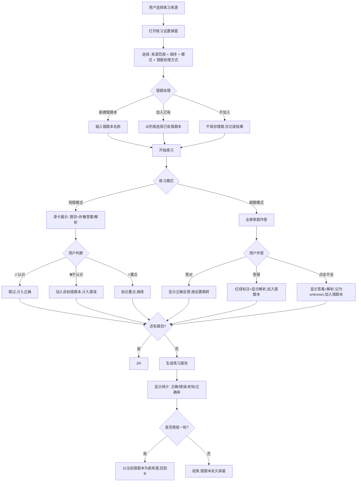
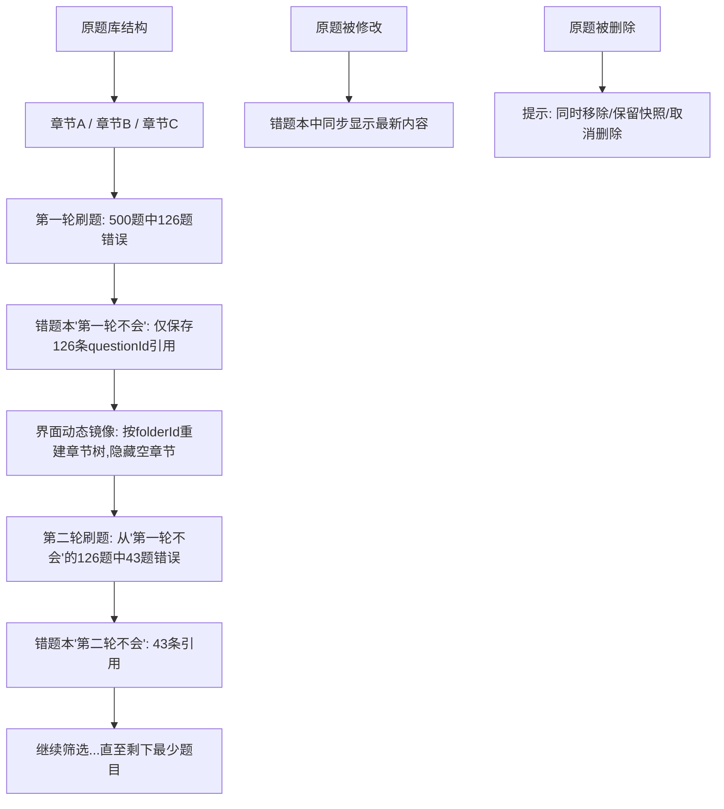

# 知行笔记 - 产品需求文档 (PRD)

## 1. 产品概述

**知行笔记**是一款无后端、离线优先、可安装为 PWA 的个人学习软件，包含两大核心模块：费曼笔记（知识整理与理解）和背题刷题（结构化题库与镜像错题本重复筛选学习）。面向需要高效笔记管理和系统化复习的学生、自学者及备考人群，所有数据本地存储，无需注册登录，不依赖任何在线服务。

## 2. 核心功能

### 2.1 功能模块总览

| 模块 | 核心功能 | 目标用户 |
|------|----------|----------|
| 费曼笔记 | 目录树管理、CodeMirror编辑器、费曼模板、双向链接、标签系统、历史版本 | 需要深度理解和整理知识的用户 |
| 题库管理 | 结构化题库（5种题型）、可视化题目编辑器、章节管理、导入导出 | 需要系统化管理试题的用户 |
| 背题模式 | 卡片式逐题展示、认识/不认识/重点标记、折叠答案与解析 | 快速浏览和记忆题目 |
| 刷题模式 | 全屏单题作答、即时反馈、自动判定、错题收集 | 模拟考试和检验掌握程度 |
| 镜像错题本 | 引用式存储、动态镜像目录结构、多轮筛选、永久保留每轮结果 | 通过重复筛选逐步缩小复习范围 |
| 备份恢复 | ZIP/JSON完整备份恢复、文档导出(TXT/Markdown/Word) | 数据安全保障 |
| PWA能力 | 可安装到桌面/主屏幕、离线可用、Service Worker后台更新 | 全场景使用体验 |

### 2.2 页面与功能详情

#### 2.2.1 笔记首页 (01_notes_home)

| 元素 | 说明 |
|------|------|
| 左侧目录栏 | 根节点"我的笔记"，支持无限层级文件夹，宽度240px(可调150-350px) |
| 右侧内容区 | 空状态提示或选中笔记的预览 |
| 顶部导航 | 模块切换（笔记/题库）、目录按钮、设置入口、搜索 |
| 目录操作 | 新建文件夹/笔记、重命名、删除、移动、拖拽排序、展开/折叠、右键菜单 |

#### 2.2.2 笔记编辑器 (02_note_editor)

| 元素 | 说明 |
|------|------|
| 面包屑路径 | 显示当前笔记完整路径 |
| 编辑区域 | CodeMirror 6 编辑器，支持富文本语法高亮 |
| 费曼模板按钮 | 右上角"插入费曼模板"，一键插入：问题、重点、解释、卡壳点、类比、总结 |
| 关键字区块 | CodeMirror实时识别关键字并应用背景色高亮 |
| 自动保存 | 输入停止500ms后写入IndexedDB；切换页面或退出前强制保存 |
| 历史版本 | 每30秒内容变化时生成快照，每个文件最多10个版本 |
| 双向链接 | `[[笔记名称]]`语法，内部保存笔记ID避免重命名失效 |
| 标签系统 | `#标签`自动识别 |
| 反向链接 | 笔记底部显示引用了当前笔记的其他笔记列表 |

#### 2.2.3 设置面板 (03_settings_panel)

| 元素 | 说明 |
|------|------|
| 常规设置 | 默认模块、自动保存间隔、主题偏好 |
| 编辑器设置 | 字体大小、编辑器主题、Tab宽度 |
| 练习设置 | 默认刷题顺序（随机/顺序）、答对后自动跳转 |
| 数据管理 | 备份、恢复、存储状态查看 |
| 关于 | 版本号、PWA更新状态 |

#### 2.2.4 题库首页 (04_question_bank_home)

| 元素 | 说明 |
|------|------|
| 题库列表 | 显示所有已建题库及题目数量 |
| 操作按钮 | 新建题库、导入题库 |
| 题库卡片 | 名称、题目总数、创建时间、操作菜单（重命名/删除/导出） |

#### 2.2.5 题库详情 (05_question_bank_detail)

| 元素 | 说明 |
|------|------|
| 左侧章节树 | 无限嵌套章节文件夹，拖拽排序 |
| 右侧题目列表 | 当前章节下的所有结构化题目 |
| 题目卡片 | 题型标识、题干摘要、选项预览、操作按钮（编辑/删除/开始练习） |
| 工具栏 | 新建章节、新建题目、批量导入 |

#### 2.2.6 创建/编辑题目弹窗 (06_create_question_modal)

| 元素 | 说明 |
|------|------|
| 题型选择 | 单选题/多选题/判断题/填空题/简答题 |
| 题干输入 | 富文本输入框 |
| 选项编辑 | 动态增删选项（单选/多选题），支持标记正确答案 |
| 答案设置 | 根据题型显示不同的答案录入方式 |
| 解析输入 | 答案解析文本 |
| 预览区 | 实时预览题目效果 |

#### 2.2.7 练习设置弹窗 (07_practice_setup)

| 元素 | 说明 |
|------|------|
| 来源范围 | 选择题库/章节/错题本作为练习来源 |
| 练习顺序 | 随机/顺序 |
| 练习模式 | 背题模式/刷题模式 |
| 错题处理 | 新建错题本(需命名)/加入已有错题本/不加入任何错题本 |
| 题目数量 | 可选择全部或指定数量 |

#### 2.2.8 背题模式 (08_memorize_mode)

| 元素 | 说明 |
|------|------|
| 卡片展示 | 题目内容、选项、折叠答案区、折叠解析区 |
| 操作按钮 | ✅认识 / ❌不认识 / ⭐重点 |
| 进度指示 | 当前题号/总题数 |
| 导航 | 上一题/下一题 |

#### 2.2.9 刷题单题界面 (09_quiz_single)

| 元素 | 说明 |
|------|------|
| 题目展示 | 完整题干和选项 |
| 作答区 | 根据题型显示不同交互（选择/填空/判断/文本） |
| 提交按钮 | 提交答案进行判定 |
| 不会按钮 | 所有题型通用，点击后直接显示答案并记录为unknown |

#### 2.2.10 刷题反馈-答错 (10_quiz_feedback_wrong)

| 元素 | 说明 |
|------|------|
| 结果展示 | 错误选项标红、正确选项标绿 |
| 正确答案 | 显示标准答案 |
| 解析展示 | 展开显示答案解析 |
| 下一题按钮 | 进入下一题 |

#### 2.2.11 练习报告 (11_practice_report)

| 元素 | 说明 |
|------|------|
| 统计概览 | 总题数、正确数、错误数、不认识数、正确率 |
| 详细列表 | 每道题的结果、作答时间 |
| 错题入口 | 查看本次生成的错题本 |
| 再练一轮 | 以当前错题本为来源开始新一轮练习 |

#### 2.2.12 镜像错题本 (12_wrongbook_mirror)

| 元素 | 说明 |
|------|------|
| 镜像目录 | 动态生成与原题库一致的章节结构（仅含错题的章节可见） |
| 错题列表 | 各章节下的错题引用（显示原题内容，非复制） |
| 错题信息 | 加入原因(wrong/unknown)、在该错题本中的答错次数 |
| 操作 | 从错题本移除、以该错题为来源开始练习 |

#### 2.2.13 备份恢复 (13_backup_restore)

| 元素 | 说明 |
|------|------|
| 备份功能 | 一键生成ZIP/JSON完整备份（含全部数据表+schemaVersion） |
| 恢复功能 | 上传备份文件并恢复数据 |
| 存储状态 | IndexedDB使用量估算、持久化存储申请状态 |
| 导出功能 | 选择格式(TXT/Markdown/Word)导出笔记或题库 |

#### 2.2.14 历史版本 (14_version_history)

| 元素 | 说明 |
|------|------|
| 版本列表 | 时间戳列表，最多10个版本 |
| 预览 | 点击查看某版本的快照内容 |
| 恢复 | 将选定版本恢复为当前内容 |
| 对比 | 可选：与当前版本差异对比 |

### 2.3 手机端适配页面

| 页面 | 适配说明 |
|------|----------|
| 笔记编辑器(手机) | 目录通过☰滑出，全屏编辑器 |
| 题库(手机) | 章节折叠列表，题目卡片紧凑排列 |
| 刷题单题(手机) | 全屏单题，大触控区域 |
| 错题本(手机) | 折叠章节，底部滑出操作菜单 |
| 底部操作菜单(手机) | 替代右键菜单，长按/⋮触发 |

## 3. 核心流程

### 3.1 笔记创建与编辑流程

```mermaid
flowchart TD
    A[用户点击新建笔记] --> B[在目录树中选择位置]
    B --> C[输入笔记名称]
    C --> D[打开CodeMirror编辑器]
    D --> E{用户操作}
    E -->|插入费曼模板| F[插入预设模板: 问题/重点/解释/卡壳点/类比/总结]
    E -->|编写内容| G[实时编辑,关键字高亮]
    E -->|添加双向链接| H[输入[[笔记名称]],内部绑定ID]
    E -->|添加标签| I[输入#标签名]
    F --> G
    G --> J{停止输入500ms}
    J --> K[自动保存到IndexedDB]
    I --> G
    H --> G
    K --> E
    E -->|切换页面/退出| L[强制保存]
    L --> M{内容变化且距上次快照>=30秒?}
    M -->|是| N[生成历史版本快照]
    M -->|否| O[完成]
    N --> O
```

### 3.2 刷题与错题本流程



### 3.3 镜像错题本核心机制



## 4. 用户界面设计

### 4.1 设计风格

| 维度 | 设计决策 |
|------|----------|
| 主色调 | 深靛蓝 `#1e3a5f` 作为主色，搭配温暖琥珀色 `#e8a838` 作为强调色 |
| 辅助色 | 正确绿色 `#16a34a`、错误红色 `#dc2626`、警告橙色 `#ea580c`、中性灰阶 `#f1f5f9` ~ `#1e293b` |
| 按钮风格 | 圆角8px，微妙阴影，hover时轻微上浮动画 |
| 字体 | 标题使用 'Noto Serif SC' 衬线字体体现学术感，正文使用 'Noto Sans SC' 无衬线字体保证可读性 |
| 布局风格 | 桌面端三栏布局（顶栏+侧边栏+内容区），卡片式内容组织 |
| 图标风格 | 线性SVG图标，2px描边，圆角端点 |
| 动效 | 页面切换300ms淡入淡入，按钮hover缩放1.02倍，侧边栏滑动200ms |

### 4.2 页面设计概览

| 页面 | 核心UI元素 | 布局特点 |
|------|-----------|----------|
| 笔记首页 | 顶栏(54px) + 左侧目录树(240px) + 右侧空状态/预览 | 经典三栏布局 |
| 笔记编辑器 | 顶栏 + 目录树 + 面包屑 + CodeMirror全宽编辑区 | 编辑器主导 |
| 题库首页 | 顶栏 + 题库网格卡片列表 | 卡片瀑布流 |
| 题库详情 | 顶栏 + 章节树 + 题目列表(双栏) | 主从结构 |
| 背题模式 | 居中大卡片 + 底部操作栏 + 进度条 | 居中聚焦 |
| 刷题模式 | 全屏单题 + 作答区 + 反馈层 | 沉浸式 |
| 练习报告 | 统计卡片 + 结果表格 + 操作按钮 | 数据仪表盘 |
| 错题本 | 镜像章节树 + 错题引用列表 | 双栏对照 |
| 手机端各页 | 顶部标题栏 + 全屏内容 + 底部操作区/滑出菜单 | 移动优先 |

### 4.3 响应式设计

| 断点 | 布局变化 | 交互差异 |
|------|----------|----------|
| >= 768px (桌面) | 侧边栏默认展开(240px)，顶栏固定54px，双栏内容区 | 右键菜单、拖拽排序、悬停效果 |
| < 768px (手机) | 侧边栏默认收起，☰按钮滑出，单栏全宽内容 | ⋮按钮+长按底部菜单、目录选择器移动 |

### 4.4 题目规则与判定规范

| 题型 | 判定逻辑 | 特殊处理 |
|------|----------|----------|
| 单选题 | 选择后立即判断，答错红绿标注 | 答对可按设置自动跳转 |
| 多选题 | 多选后点击提交，答案集合必须完全一致 | 内部统一ACD/A,C,D/A C D为数组 |
| 判断题 | 接受对/错、正确/错误、true/false、√/× | 内部统一为boolean |
| 填空题 | 下划线转输入框，多空用\|\|分隔，同义用\|分隔 | 忽略首尾空格、大小写、连续空格 |
| 简答题 | 不自动评分，用户自行判断 | 手动点击"我会了"或"不认识" |
| 通用"不会" | 所有题型提供，点击后立即显示答案解析 | 记录为unknown，若配置了目标错题本则加入 |
