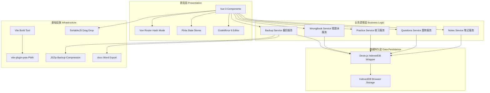
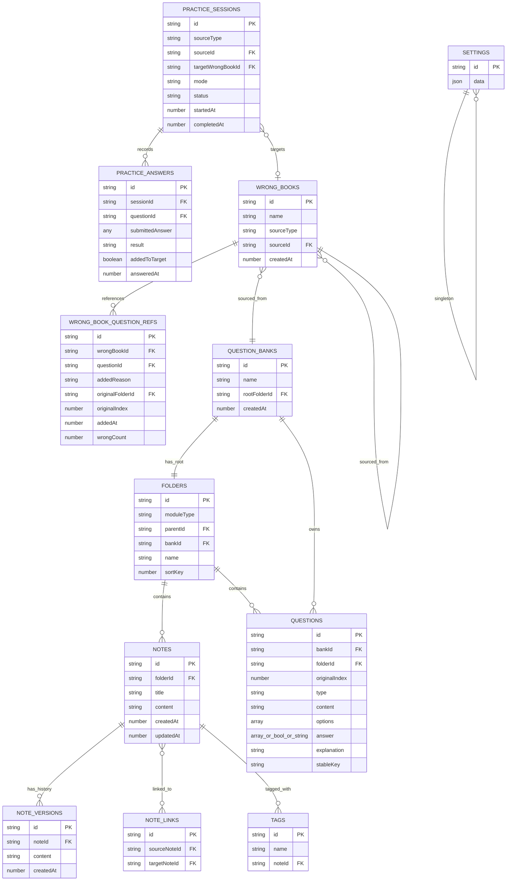
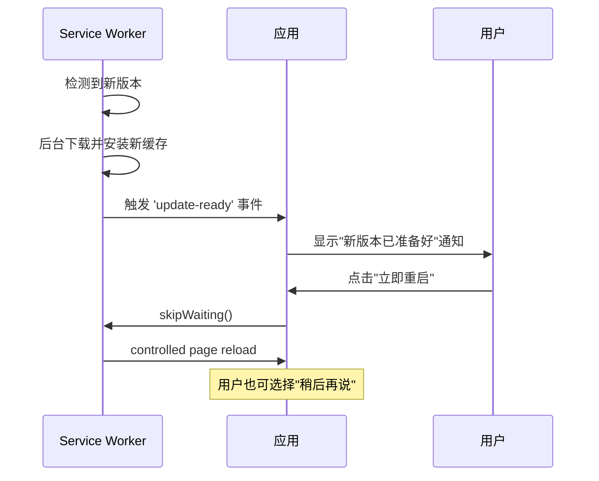

# 知行笔记 - 技术架构文档

## 1. 架构设计



## 2. 技术选型

| 技术 | 版本 | 用途 | 选型理由 |
|------|------|------|----------|
| Vite | ^5.x | 构建工具 | 极速HMR、原生ESM、优秀TS支持 |
| Vue 3 | ^3.4.x | 前端框架 | Composition API、响应式系统、轻量高效 |
| TypeScript | ^5.x | 类型安全 | 完整类型推导、编译时错误检查 |
| Pinia | ^2.x | 状态管理 | Vue官方推荐、轻量、TypeScript友好 |
| Vue Router | ^4.x | 路由管理 | Hash模式兼容GitHub Pages |
| CodeMirror 6 | ^6.x | Markdown编辑器 | 可编程、可扩展、高性能 |
| Dexie.js | ^4.x | IndexedDB封装 | 简洁API、支持索引、事务支持 |
| vite-plugin-pwa | ^0.20.x | PWA支持 | Workbox集成、离线缓存、自动更新 |
| SortableJS | ^1.15.x | 拖拽排序 | 高性能、触摸兼容 |
| JSZip | ^3.10.x | ZIP压缩 | 浏览器端压缩解压 |
| docx | ^9.x | Word导出 | 纯前端生成docx文件 |

## 3. 项目目录结构

```
zhixing-notes/
├── public/
│   ├── icons/                  # PWA图标 (192x192, 512x512)
│   ├── logo/                   # 应用Logo SVG
│   └── illustrations/          # 空状态/离线/备份插图 SVG
├── src/
│   ├── assets/
│   │   ├── icons/              # 通用SVG图标
│   │   └── styles/
│   │       ├── variables.css   # CSS变量(颜色/字号/间距)
│   │       ├── global.css      # 全局样式
│   │       └── editor.css      # CodeMirror编辑器样式
│   ├── components/
│   │   ├── layout/
│   │   │   ├── AppTopBar.vue           # 顶部导航栏
│   │   │   ├── SidebarTree.vue         # 侧边栏目录树
│   │   │   └── AppLayout.vue           # 整体布局容器
│   │   ├── notes/
│   │   │   ├── NoteEditor.vue          # 笔记编辑器(CodeMirror)
│   │   │   ├── FeynmanTemplate.vue     # 费曼模板组件
│   │   │   ├── BackLinks.vue           # 反向链接面板
│   │   │   └── VersionHistoryPanel.vue # 历史版本面板
│   │   ├── questions/
│   │   │   ├── QuestionBankView.vue    # 题库视图(章节+题目)
│   │   │   ├── QuestionFormModal.vue   # 创建/编辑题目弹窗
│   │   │   ├── QuestionCard.vue        # 题目卡片
│   │   │   └── QuestionBankList.vue    # 题库列表页
│   │   ├── practice/
│   │   │   ├── PracticeSetupModal.vue  # 练习设置弹窗
│   │   │   ├── MemorizeCard.vue        # 背题模式卡片
│   │   │   ├── QuizRunner.vue          # 刷题模式运行器
│   │   │   └── PracticeReport.vue      # 练习报告
│   │   ├── wrongbook/
│   │   │   └── WrongBookMirrorTree.vue # 镜像错题本目录树
│   │   ├── common/
│   │   │   ├── ContextMenu.vue         # 桌面端右键菜单
│   │   │   ├── MobileBottomSheet.vue   # 手机端底部弹出菜单
│   │   │   ├── Modal.vue               # 通用模态框
│   │   │   └── EmptyState.vue          # 空状态占位
│   │   └── settings/
│   │       ├── SettingsPanel.vue       # 设置面板
│   │       └── BackupRestorePanel.vue  # 备份恢复面板
│   ├── composables/
│   │   ├── useAutoSave.ts             # 自动保存逻辑
│   │   ├── useContextMenu.ts          # 右键菜单逻辑
│   │   ├── useDragDrop.ts             # 拖拽排序逻辑
│   │   ├── useKeyboardShortcuts.ts    # 快捷键
│   │   └── useResponsive.ts           # 响应式断点检测
│   ├── stores/
│   │   ├── notesStore.ts              # 笔记状态管理
│   │   ├── questionsStore.ts          # 题库状态管理
│   │   ├── practiceStore.ts           # 练习状态管理
│   │   ├── wrongBookStore.ts          # 错题本状态管理
│   │   ├── settingsStore.ts           # 设置状态管理
│   │   └── uiStore.ts                 # UI状态(侧边栏/模态框)
│   ├── services/
│   │   ├── db.ts                      # Dexie数据库定义与初始化
│   │   ├── noteService.ts             # 笔记CRUD操作
│   │   ├── questionService.ts         # 题库CRUD操作
│   │   ├── practiceService.ts         # 练习流程控制
│   │   ├── wrongBookService.ts        # 错题本逻辑
│   │   ├── backupService.ts           # 备份/恢复/导出
│   │   ├── searchService.ts           # 全局搜索
│   │   └── exportService.ts           # 文档导出(TXT/MD/DOCX)
│   ├── types/
│   │   ├── index.ts                   # 全局类型导出
│   │   ├── note.ts                    # 笔记相关类型
│   │   ├── question.ts                # 题目相关类型
│   │   ├── practice.ts                # 练习相关类型
│   │   ├── wrongbook.ts               # 错题本相关类型
│   │   └── database.ts                # 数据库表类型定义
│   ├── utils/
│   │   ├── id.ts                      # UUID生成
│   │   ├── date.ts                    # 日期格式化
│   │   ├── questionJudge.ts           # 题目判定引擎
│   │   ├── feymanParser.ts            # 费曼语法解析器
│   │   └── debounce.ts                # 防抖工具
│   ├── router/
│   │   └── index.ts                   # 路由定义(Hash模式)
│   ├── views/
│   │   ├── NotesView.vue              # 笔记模块主页
│   │   ├── QuestionsView.vue          # 题库模块主页
│   │   ├── PracticeView.vue           # 练习视图(背题/刷题)
│   │   └── SettingsView.vue           # 设置页面
│   ├── App.vue                        # 根组件
│   ├── main.ts                        # 应用入口
│   └── style.css                      # 全局样式入口
├── index.html
├── vite.config.ts
├── tsconfig.json
├── tsconfig.node.json
├── package.json
└── README.md
```

## 4. 路由定义

| 路由路径 | 组件 | 说明 |
|----------|------|------|
| `#/notes` | NotesView | 笔记首页（目录+编辑器） |
| `#/notes/:noteId` | NotesView | 打开指定笔记编辑 |
| `#/questions` | QuestionsView | 题库列表 |
| `#/questions/:bankId` | QuestionsView | 题库详情（章节+题目） |
| `#/questions/:bankId/folder/:folderId` | QuestionsView | 指定章节的题目列表 |
| `#/practice` | PracticeView | 练习中（背题/刷题） |
| `#/practice/report/:sessionId` | PracticeView | 练习报告 |
| `#/wrongbook/:wrongBookId` | QuestionsView(错题本模式) | 错题本镜像视图 |
| `#/settings` | SettingsView | 设置面板 |

## 5. 数据模型 (IndexedDB via Dexie.js)

### 5.1 ER关系图



### 5.2 Dexie.js 数据库定义

```typescript
// types/database.ts - 核心类型定义
export type ModuleType = 'notes' | 'questions'
export type QuestionType = 'single' | 'multiple' | 'trueFalse' | 'blank' | 'shortAnswer'
export type PracticeMode = 'memorize' | 'quiz'
export type PracticeStatus = 'active' | 'completed' | 'abandoned'
export type AnswerResult = 'correct' | 'wrong' | 'unknown'
export type WrongBookSourceType = 'bank' | 'wrongBook'
export type AddedReason = 'wrong' | 'unknown'

export interface Folder {
  id: string
  moduleType: ModuleType
  parentId: string | null
  bankId: string | null
  name: string
  sortKey: number
}

export interface QuestionBank {
  id: string
  name: string
  rootFolderId: string
  createdAt: number
}

export interface QuestionOption {
  label: string  // A, B, C, D...
  text: string
  isCorrect?: boolean
}

export interface Question {
  id: string
  bankId: string
  folderId: string
  originalIndex: number
  type: QuestionType
  content: string
  options: QuestionOption[]
  answer: boolean | string[] | string
  explanation: string
  stableKey: string
}

export interface Note {
  id: string
  folderId: string
  title: string
  content: string
  createdAt: number
  updatedAt: number
}

export interface NoteVersion {
  id: string
  noteId: string
  content: string
  createdAt: number
}

export interface NoteLink {
  id: string
  sourceNoteId: string
  targetNoteId: string
}

export interface Tag {
  id: string
  name: string
  noteId: string
}

export interface WrongBook {
  id: string
  name: string
  sourceType: WrongBookSourceType
  sourceId: string
  createdAt: number
}

export interface WrongBookQuestionRef {
  id: string
  wrongBookId: string
  questionId: string
  addedReason: AddedReason
  originalFolderId: string
  originalIndex: number
  addedAt: number
  wrongCount: number
}

export interface PracticeSession {
  id: string
  sourceType: 'bank' | 'wrongBook' | 'folder'
  sourceId: string
  targetWrongBookId: string | null
  mode: PracticeMode
  status: PracticeStatus
  startedAt: number
  completedAt: number | null
}

export interface PracticeAnswer {
  id: string
  sessionId: string
  questionId: string
  submittedAnswer: any
  result: AnswerResult
  addedToTarget: boolean
  answeredAt: number
}

export interface AppSettings {
  id: string
  data: {
    defaultModule: 'notes' | 'questions'
    autoSaveInterval: number
    editorFontSize: number
    editorTheme: string
    quizOrder: 'random' | 'sequential'
    autoAdvanceOnCorrect: boolean
    sidebarWidth: number
  }
}
```

## 6. 核心服务接口设计

### 6.1 笔记服务 (noteService.ts)

```typescript
// 核心方法签名
class NoteService {
  // CRUD
  createNote(folderId: string, title: string): Promise<Note>
  getNote(id: string): Promise<Note | undefined>
  updateNote(id: string, content: string): Promise<void>
  deleteNote(id: string): Promise<void>
  
  // 目录操作
  createFolder(parentId: string | null, name: string, moduleType: ModuleType): Promise<Folder>
  renameFolder(id: string, name: string): Promise<void>
  deleteFolder(id: string): Promise<void>
  moveFolder(id: string, newParentId: string | null): Promise<void>
  getTree(rootId: string | null, moduleType: ModuleType): Promise<TreeNode[]>
  
  // 费曼特性
  insertFeynmanTemplate(noteId: string): Promise<string>  // 返回模板文本
  parseLinks(content: string): { links: NoteLink[], text: string }
  parseTags(content: string): string[]
  getBackLinks(noteId: string): Promise<Note[]>
  
  // 历史版本
  saveVersion(noteId: string, content: string): Promise<NoteVersion>
  getVersions(noteId: string): Promise<NoteVersion[]>
  restoreVersion(noteId: string, versionId: string): Promise<void>
  
  // 自动保存
  debouncedSave(noteId: string, content: string): void
}
```

### 6.2 题库服务 (questionService.ts)

```typescript
class QuestionService {
  // 题库管理
  createBank(name: string): Promise<QuestionBank>
  renameBank(id: string, name: string): Promise<void>
  deleteBank(id: string): Promise<void>
  getBanks(): Promise<QuestionBank[]>
  
  // 题目CRUD
  createQuestion(bankId: string, folderId: string, data: Partial<Question>): Promise<Question>
  updateQuestion(id: string, data: Partial<Question>): Promise<void>
  deleteQuestion(id: string): Promise<void>  // 检查错题本引用
  getQuestionsByFolder(folderId: string): Promise<Question[]>
  getQuestionsByBank(bankId: string): Promise<Question[]>
  
  // 题目判定
  judgeAnswer(question: Question, submittedAnswer: any): AnswerResult
  
  // 导入导出
  importFromMarkdown(text: string, bankId: string): Promise<number>
  exportToMarkdown(bankId: string): Promise<string>
  importFromDocx(file: File, bankId: string): Promise<number>
}
```

### 6.3 练习服务 (practiceService.ts)

```typescript
class PracticeService {
  // 创建练习会话
  createSession(config: PracticeConfig): Promise<PracticeSession>
  
  // 获取题目队列
  getQuestionQueue(sessionId: string): Promise<Question[]>
  
  // 提交答案
  submitAnswer(sessionId: string, questionId: string, answer: any): Promise<PracticeAnswer>
  
  // 标记不会
  markUnknown(sessionId: string, questionId: string): Promise<PracticeAnswer>
  
  // 完成练习
  completeSession(sessionId: string): Promise<PracticeSession>
  
  // 获取报告
  getReport(sessionId: string): Promise<PracticeReport>
}

interface PracticeConfig {
  sourceType: 'bank' | 'wrongBook' | 'folder'
  sourceId: string
  mode: 'memorize' | 'quiz'
  order: 'random' | 'sequential'
  count?: number  // undefined = 全部
  wrongBookAction: 'create' | 'join' | 'none'
  targetWrongBookId?: string  // join时使用
  newWrongBookName?: string   // create时使用
}
```

### 6.4 错题本服务 (wrongBookService.ts)

```typescript
class WrongBookService {
  // 创建错题本
  createWrongBook(name: string, sourceType: WrongBookSourceType, sourceId: string): Promise<WrongBook>
  
  // 添加错题引用(去重)
  addQuestionRef(wrongBookId: string, questionId: string, reason: AddedReason, folderId: string, index: number): Promise<void>
  
  // 获取镜像目录树
  getMirrorTree(wrongBookId: string): Promise<MirrorTreeNode[]>  // 动态构建
  
  // 获取错题本中的题目
  getWrongQuestions(wrongBookId: string, folderId?: string): Promise<QuestionWithRef[]>
  
  // 移除错题引用
  removeQuestionRef(wrongBookId: string, questionId: string): Promise<void>
  
  // 增加答错计数
  incrementWrongCount(refId: string): Promise<void>
  
  // 获取所有错题本
  getAllWrongBooks(): Promise<WrongBook[]>
  
  // 原题删除时的级联处理
  handleOriginalQuestionDelete(questionId: string, action: 'remove' | 'snapshot' | 'cancel'): Promise<void>
}
```

### 6.5 备份服务 (backupService.ts)

```typescript
class BackupService {
  // 创建完整备份
  createBackup(): Promise<Blob>  // 返回ZIP Blob
  
  // 恢复备份
  restoreBackup(file: File): Promise<void>
  
  // 导出文档
  exportNoteToTxt(noteIds: string[]): Promise<Blob>
  exportNoteToMarkdown(noteIds: string[]): Promise<Blob>
  exportNoteToDocx(noteIds: string[]): Promise<Blob>
  exportBankToMarkdown(bankId: string): Promise<Blob>
  exportBankToDocx(bankId: string): Promise<Blob>
  
  // 获取存储信息
  getStorageEstimate(): Promise<{ used: string; quota: string }>
  requestPersistence(): Promise<boolean>
}

interface BackupData {
  schemaVersion: number
  exportedAt: number
  folders: Folder[]
  questionBanks: QuestionBank[]
  questions: Question[]
  notes: Note[]
  noteVersions: NoteVersion[]
  tags: Tag[]
  noteLinks: NoteLink[]
  wrongBooks: WrongBook[]
  wrongBookQuestionRefs: WrongBookQuestionRef[]
  practiceSessions: PracticeSession[]
  practiceAnswers: PracticeAnswer[]
  settings: AppSettings
}
```

## 7. PWA 配置

### 7.1 Vite PWA 插件配置要点

- **缓存策略**: NetworkFirst for HTML/js/css, CacheFirst for static assets (icons, fonts, images)
- **Workbox**: 使用 injectManifest 策略，自定义 service-worker
- **离线资源**: 缓存所有HTML/JS/CSS/SVG图标/PWA图标/编辑器资源/字体
- **禁止CDN**: 不依赖任何外部CDN资源（字体、图标、脚本）
- **更新策略**: 后台静默下载新版本，通过事件通知用户"新版本已准备好"
- **manifest配置**: 应用名"知行笔记"、theme_color、背景色、图标192/512

### 7.2 Service Worker 更新流程



## 8. 性能指标与安全要求

### 8.1 性能指标

| 指标 | 目标值 |
|------|--------|
| 首次内容绘制(FCP) | < 1.5s |
| 最大内容绘制(LCP) | < 2.5s |
| 首次输入延迟(FID) | < 100ms |
| 累积布局偏移(CLS) | < 0.1 |
| 编辑器输入延迟 | < 50ms (500ms防抖保存) |
| 大型题库(1000+题)加载 | < 2s |
| 备份生成(全量数据) | < 5s |

### 8.2 安全要求

- 所有数据存储在浏览器 IndexedDB，不上传服务器
- 启动时调用 `navigator.storage.persist()` 申请持久化
- 备份文件包含 schemaVersion 用于版本校验
- 恢复备份数据前进行格式验证
- XSS防护：用户输入内容在渲染时进行转义处理

### 8.3 兼容性标准

| 目标 | 要求 |
|------|------|
| 浏览器 | Chrome 90+, Firefox 90+, Edge 90+, Safari 15+ |
| 移动端 | iOS Safari 15+, Chrome Android 90+ |
| PWA安装 | 支持桌面端和移动端安装 |
| IndexedDB | 所有现代浏览器原生支持 |
| 离线运行 | Service Worker注册后完全离线可用 |
| 屏幕尺寸 | 320px ~ 2560px 自适应 |
